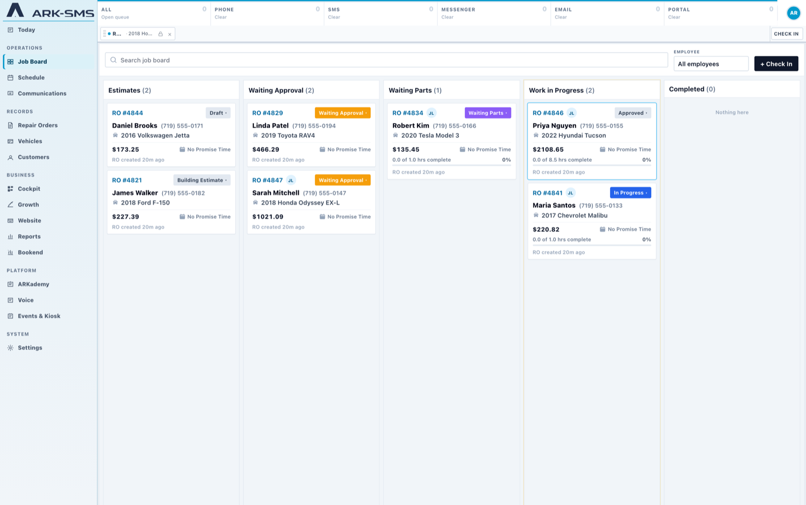
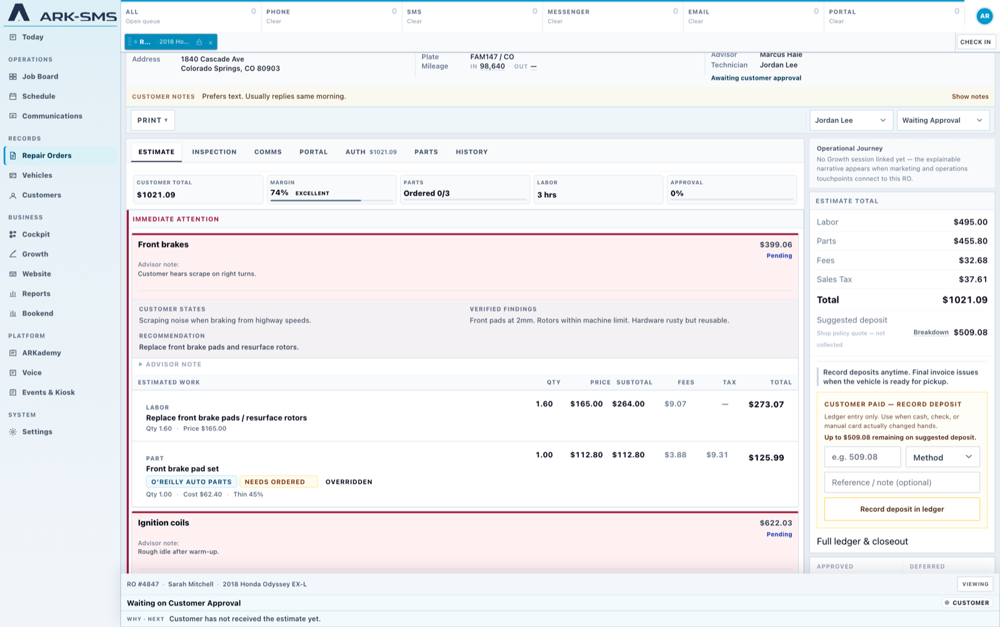
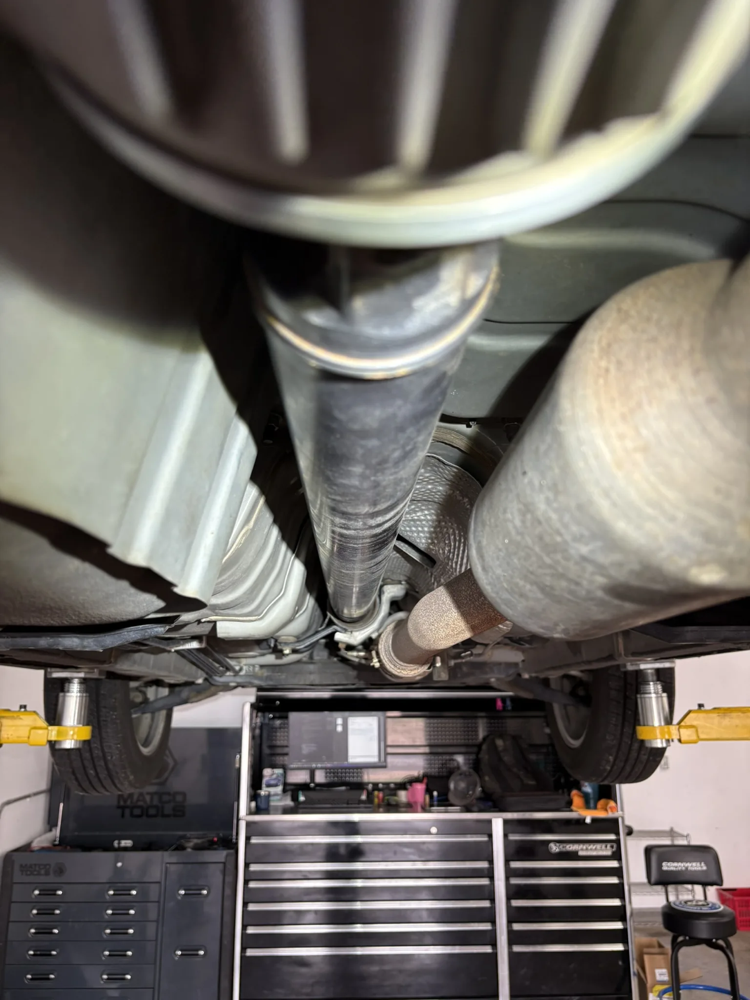
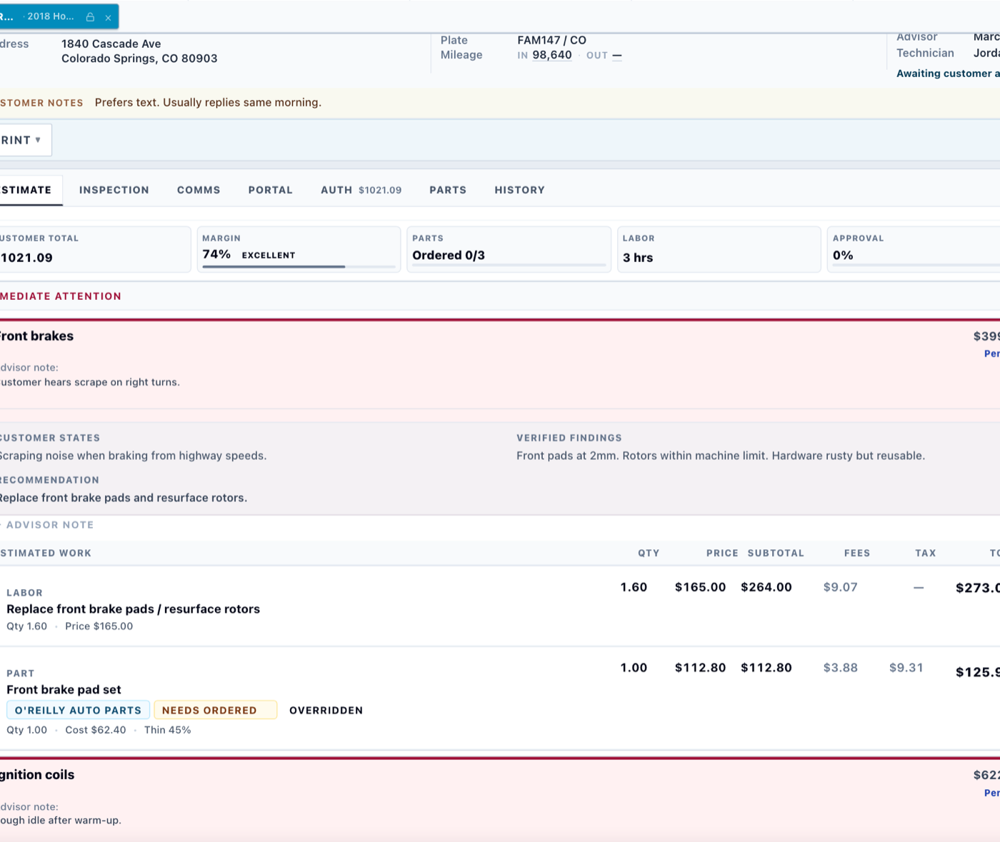
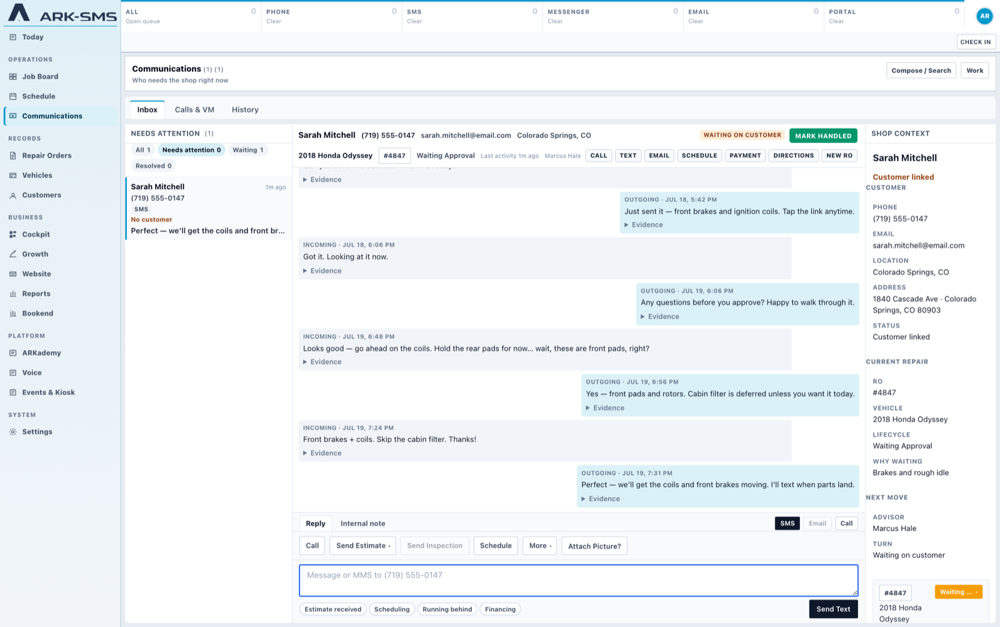

# ARK

**Shop management software for independent auto repair shops.**

**Copyright (C) 2026 Edward Soares Jr.** · Licensed under **AGPL-3.0-only** (see `LICENSE`).

ARK is shop management software built around the way an automotive repair shop actually operates. It handles repair orders, customers, vehicles, estimates, inspections, scheduling, communications, and the day-to-day workflows between advisors and technicians.

Under the hood, ARK is designed around clear sources of truth, predictable system behavior, and server-side business rules rather than duplicating important logic throughout the application.

This repository contains the **public open-source distribution of ARK**. It is the **canonical Core** repository. Confirm identity with `./scripts/assert-canonical-core-repo.sh` (Git root + `origin`, not the folder name).

ARK Platform is a separate repository. The private `arksmsv2` tree is legacy and must not receive new Core development.

It is a clean public snapshot and does not include private shop data, production credentials or infrastructure, licensed automotive datasets, or private Dragon knowledge sources.

## What you get

* **ARK Web** — the Laravel-based core shop management system (operations, portal, installer)
* Database migrations, automated tests, and configuration examples
* Synthetic/demo shop seed data
* **Dragon runtime** with support for your own model provider credentials
* Labor-guide import interfaces for integrating supported external data sources
* Server-side **API contracts** for mobile and third-party clients (`/api/mobile`, station pairing, and related endpoints)

Marketing website CMS and SEO tools are not part of Core. Core may hold shop website **records** (drafts and publications) for Platform and Foundry. The editor UI belongs in Platform. See `docs/platform/ark-core-website-boundary.md` and `docs/engineering/CANONICAL_REPOSITORY.md`.

## What is not included

Some parts of the environment used to operate and develop ARK cannot or should not be distributed publicly. This repository does not include:

* Production deployment runbooks or infrastructure configuration
* Credentials, backups, or live secrets
* Real-Time Labor Guide (RTE) or other licensed automotive datasets
* Private Dragon knowledge imports or ARKademy data
* Republished third-party training material

**Open the engine. Bring your own fuel.**

## See ARK in action

### Run the shop from one place



### Repair orders that keep the full story of the job together



### Digital vehicle inspections



### Customer estimates and approvals



### Customer communication built into the workflow



## Requirements

ARK can be run with Docker Compose or directly on a compatible PHP environment.

* PHP 8.3+ — match the version requirements in `composer.json`
* Composer when running directly on the host
* Node.js and npm for Vite assets
* MySQL 8 for the application database
* Redis — required for the Docker Compose runtime (cache, sessions, queues, Horizon)

Automated tests use isolated SQLite (`:memory:` per process) through Pest/PHPUnit. Tests do not use your application MySQL database.

```bash
composer test:parallel   # fast full suite (8 workers)
composer test:serial     # single-process diagnostic
./scripts/test-fast.sh   # same as test:parallel; TEST_PROCESSES=8
```

## Quick start with Docker Compose

**Recommended.** Compose boots the same runtime architecture ARK runs in production:

MySQL · Redis · app (nginx, PHP-FPM, Horizon, Reverb, scheduler) · persistent storage

```bash
git clone https://github.com/EdwardSoaresJr/ark.git
cd ark
docker compose up -d --build
```

Then open:

**http://localhost:8088/setup**

The setup wizard uses the database Compose already created. You should not need to type database credentials.

Cloud VPS with HTTPS: [`docs/installation/vultr.md`](docs/installation/vultr.md).

**Moving hosts:** durable shop state is MySQL + persistent `storage/` + installation secrets. See [`docs/installation/portable-state.md`](docs/installation/portable-state.md).

See `docs/installation/README.md` for what the stack includes and for advanced (non-Docker) installation.

## Quick start with local PHP

```bash
composer install
cp .env.example .env

# You may configure APP_KEY and DB_* manually,
# or allow /setup to guide configuration on writable installs.
php artisan key:generate

# Point DB_* at an empty MySQL database, then:
php artisan serve
```

Open the application URL in your browser. If ARK has not been installed yet, it will direct you to **`/setup`**.

Environment-based bootstrap configuration is also available for advanced deployments, but the setup wizard is the normal installation path.

Development seeders may create example staff accounts such as `admin@ark.test`. These accounts are for development and demonstration use only. A normal production installation creates its own administrator during setup.

## Optional integrations and ARK Services

ARK Core operates as a complete shop management system without third-party integrations or ARK Platform.

Optional integrations include:

* External / manual payment recording (ledger)
* ARK Email and other managed services through **ARK Platform** pairing
* External labor-guide imports
* NHTSA VIN decode (built in)

First-party client applications (Desk, Tech, Companion, and similar) are separate products and are not included in this repository. Third-party developers can build alternative clients against the Core API contracts documented under `docs/` and exposed at `/api/mobile`.

Features that depend on an integration or managed service remain disabled or clearly report that configuration is required when credentials are not available.

Configure only the integrations and services you intend to use.

### Dragon

Dragon runtime ships with Core. Configure model providers through **Settings → Dragon** after install, or use `DRAGON_PROVIDER=fake` in development and tests.

Stock Core does not include private shop knowledge sources or proprietary knowledge imports.

## Architecture

A few architectural rules are important when working on ARK:

* **Database per tenant** — ARK does not use a shared-database `shop_id` tenancy model.
* **Workstations and stations** represent physical locations within a shop, not separate tenants.
* **Authoritative services own business truth.** Projections and views present that information rather than independently recreating it.
* **Financial calculations stay server-side.** Important totals should come from authoritative calculators instead of being duplicated in client-side JavaScript.

These boundaries are intentional and should be preserved when extending the application.

See `docs/engineering/` for additional architecture and engineering documentation. Some historical documentation may still reference the shop environment where ARK was originally developed and tested.

## License

**Copyright (C) 2026 Edward Soares Jr.**

ARK is open-source software licensed under the **GNU Affero General Public License v3.0 only** (`AGPL-3.0-only`).

See:

* `LICENSE`
* `NOTICE`

Core records external payments on the ledger. Managed processor connectivity is
not part of this repository — see `docs/platform/ark-payments-boundary-v1.md`.

For project naming and branding guidelines, see `TRADEMARKS.md`.

You may modify and fork ARK under the terms of the AGPL. Modified distributions should not be presented as the official ARK distribution without permission.

The licensing information in this repository describes the project's licensing choices and is not legal advice.

## Status

ARK is publicly available at:

https://github.com/EdwardSoaresJr/ark
