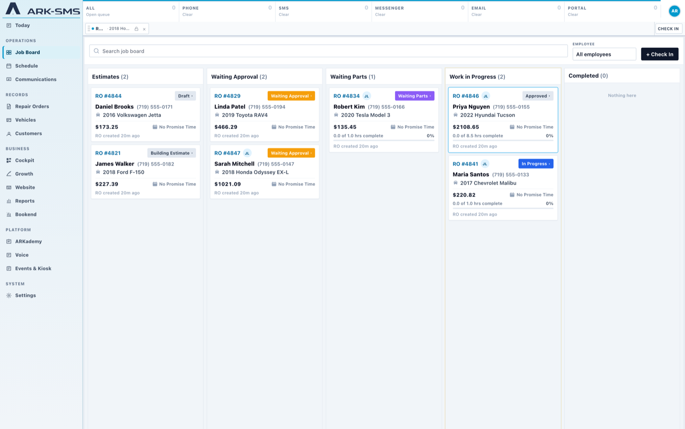
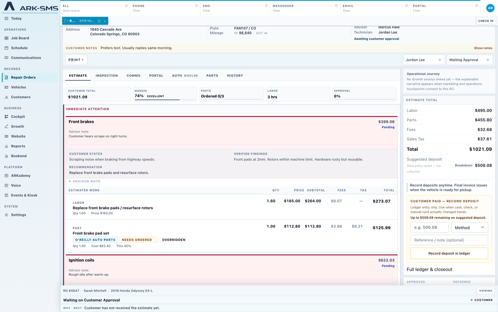
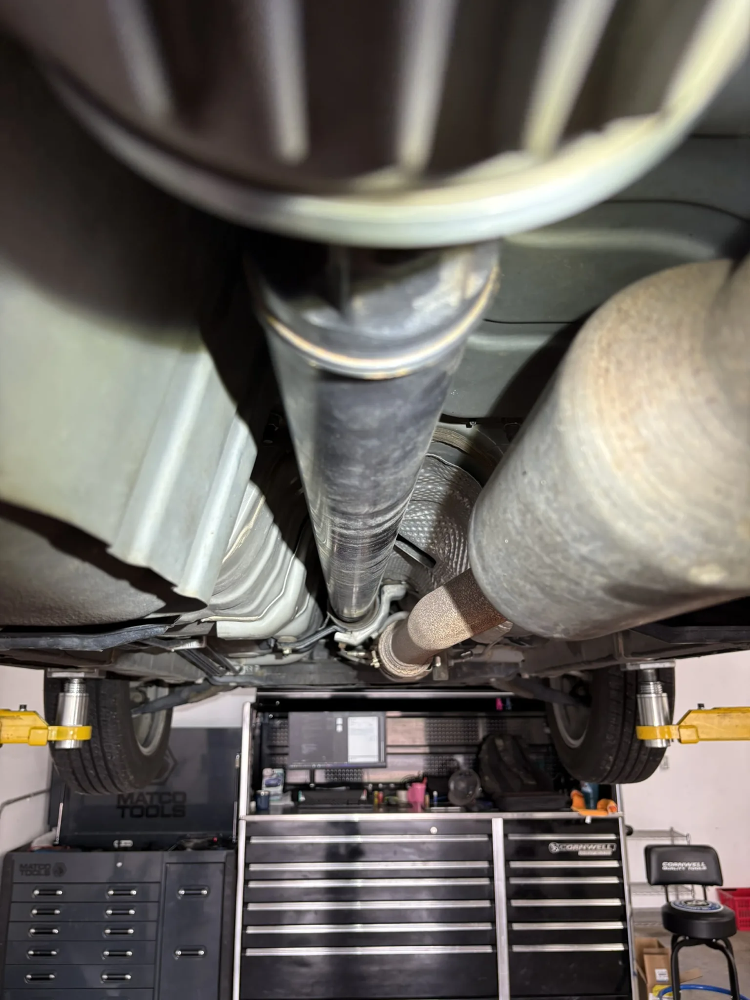
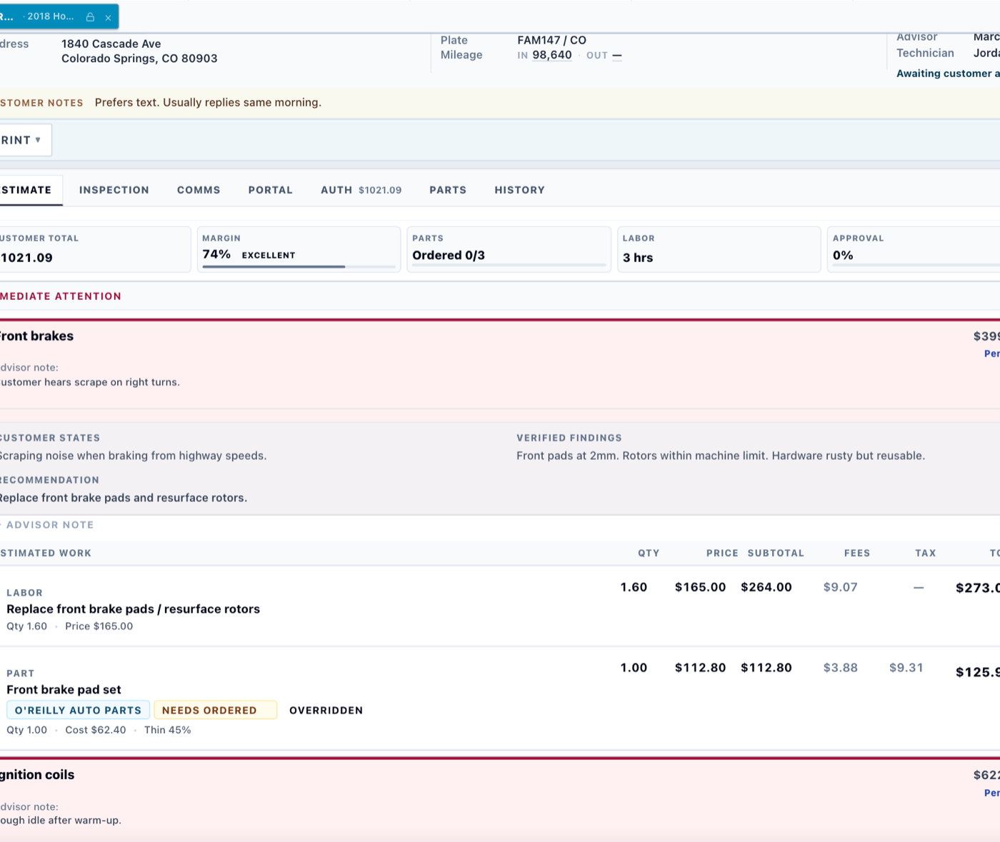
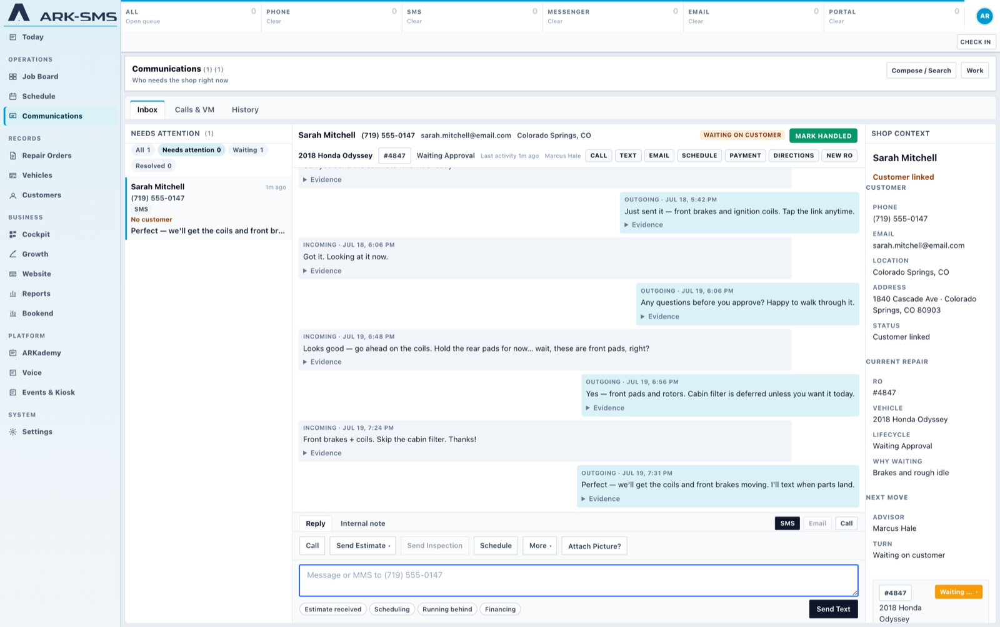

# ARK Core

Free, open-source shop management for independent auto repair shops.

ARK Core is the shop-management system itself. A shop can run it on its own server: customers, vehicles, repair orders, estimates, inspections, scheduling, production, reporting, documents, and the payment ledger. It is free under the AGPL. It is not a trial, a time limit, or a teaser for a hosted service.

**Copyright (C) 2026 Edward Soares Jr.** · Licensed under **AGPL-3.0-only** (see `LICENSE`).

[Try the live demo](https://demo.arksms.com)

## What you get

A stock install (Docker Compose and `/setup`) includes the workflows below. No ARK SaaS account is required.

**The work**

- Customer and vehicle records, with search, CSV import, and NHTSA VIN decode
- Repair orders with concerns, labor, parts, fees, and notes
- Estimates with quantity and hours, server-side totals, tax, and customer authorization
- Digital vehicle inspections, including templates, photos, and prior-visit history
- Scheduling, including appointment bays
- Job board, shop display, and the daily production view
- Technician workflows and a time clock
- Parts and labor lines, parts pricing matrices, and labor rates
- Engine-oil service on the repair order, including what was installed

**The business**

- Dashboard, day review, and technician production
- Reports: end of day, sales and payments, margin health, owner P&L, operations, and production
- A ledger for payments the shop already took (cash, check, or a card charged outside ARK)
- Tax, shop fees, deposits, and customer types
- Documents, estimate and invoice PDFs, and printing settings
- Label printing (QZ Tray) after the shop supplies its own certificate and private key
- A customer portal for estimates, approvals, inspections, photos, and documents
- Staff, roles, workstations, and shop configuration
- A responsive shop interface, including phone-sized navigation

The customer portal can show an amount owed. Showing that amount is not card processing. Charging a card inside ARK is Hosted ARK.

AllData and ProDemand buttons open the vendor site and copy the VIN. The shop uses its own login. Core also includes a labor-guide import interface. Licensed labor-guide datasets are not in this repository.

**For developers**

- First-run installer
- Database migrations, tests, and configuration examples
- Optional demo shop seed data
- Dragon, so you can connect your own model provider. No ARK-hosted model is included.
- API contracts for separate client apps (`/api/mobile`, `/api/desk`, `/api/tech`, `/api/station`). The apps themselves are not in this repository.

The shop website editor is not part of Core. Core can keep shop identity and lead records. See [docs/platform/ark-core-website-boundary.md](docs/platform/ark-core-website-boundary.md).

## You do not need Hosted ARK to use ARK Core

A stock Core installation can operate the shop on your own infrastructure. Repair orders, estimates, authorization, inspections, scheduling, the job board, the time clock, reporting, documents, the customer portal, and the ledger all work without an ARK SaaS account.

## Hosted ARK

Hosted ARK (ARK SaaS) is a private commercial product. It is built from a pinned ARK Core release, plus services ARK operates, commercial integrations, and managed infrastructure.

Revenue from Hosted ARK helps fund continued development and maintenance of free, open-source ARK Core.

Hosted ARK is being built as the fully managed way to run ARK, including infrastructure, deployment, updates, backups, monitoring, communications, payments, and commercial integrations. It is not open for general customer signup or provisioning today.

**Commercial capabilities already implemented**

These ARK-operated services already exist in the ARK ecosystem. They belong to Hosted ARK, not to a stock Core install. Listing them is not a statement that a new shop can sign up for Hosted ARK today.

- Customer email
- Customer texting
- Hosted phone service
- In-app card capture
- PartsTech shop catalog access

**Managed infrastructure, in development**

The fully managed Hosted ARK product is still being built. Managed infrastructure, deployment, updates, backups, and operational monitoring are not available today.

Also not available today: ARK Backup, ARK Storage, ARK Data, moving a shop between self-hosted Core and Hosted ARK, ARK Connect, and an ARK-hosted Dragon model.

This page does not publish prices or packaging.

## Why some Hosted work is not in this repository

ARK Core is intentionally open source. Hosted ARK adds paid services and integrations around it.

Some commercial integrations use partner APIs, documentation, or implementation details that we are not permitted to redistribute publicly. Those integrations are available only as part of Hosted ARK.

PartsTech is one example. Shop catalog access is part of Hosted ARK. This repository does not publish the partner API materials for that integration.

## A screen is not the service

Core includes shop screens for communications, conversations, calls, parts catalogs, and payments. Those screens are the shop workflow. They do not mean the ARK-operated service ships with a free install.

Sending customer texts or email, operating hosted phones, capturing a card inside ARK, and opening the shop parts catalog require Hosted ARK. When those services are not connected, Core says so and the rest of the shop keeps running.

Settings can still show Communications, Parts catalogs, or Square Payments. A settings screen is not a self-hosted texting, catalog, or card-processing product.

See [docs/PRODUCT_BOUNDARY.md](docs/PRODUCT_BOUNDARY.md).

## What is not included

- The Hosted ARK services above, including services still in development
- Licensed automotive datasets, including labor-guide data
- Desk, Tech, Companion, and similar client applications
- The shop website editor
- Production credentials or live shop data
- Private Dragon knowledge or training imports
- An ARK-hosted model

## See ARK in action

### Run the shop from one place



### Repair orders that keep the full story of the job together



### Digital vehicle inspections



### Customer estimates and approvals



### Communications workspace

The communications screen is part of Core. Sending texts or email, and hosted phones, are Hosted ARK.



## Requirements

ARK can be run with Docker Compose or directly on a compatible PHP environment.

* PHP 8.3+ - match the version requirements in `composer.json`
* Composer when running directly on the host
* Node.js and npm for Vite assets
* MySQL 8 for the application database
* Redis - required for the Docker Compose runtime (cache, sessions, queues, Horizon)

Automated tests use isolated SQLite (`:memory:` per process) through Pest/PHPUnit. Tests do not use your application MySQL database.

```bash
composer test:parallel   # fast full suite (8 workers)
composer test:serial     # single-process diagnostic
./scripts/test-fast.sh   # same as test:parallel; TEST_PROCESSES=8
```

## Quick start with Docker Compose

This builds from the local tree and is the normal way to try Core on your own machine.

Compose boots MySQL, Redis, and the app (nginx, PHP-FPM, Horizon, Reverb, scheduler), with persistent storage.

```bash
git clone https://github.com/EdwardSoaresJr/ark-core.git
cd ark-core
docker compose up -d --build
```

Then open:

**http://localhost:8088/setup**

The setup wizard uses the database Compose already created. You should not need to type database credentials.

Cloud VPS with HTTPS: [`docs/installation/vultr.md`](docs/installation/vultr.md).

**Moving hosts:** durable shop state is MySQL + persistent `storage/` + installation secrets. See [`docs/installation/portable-state.md`](docs/installation/portable-state.md).

See `docs/installation/README.md` for what the stack includes and for advanced (non-Docker) installation.

## Quick start with local PHP

```bash
composer install
cp .env.example .env

# You may configure APP_KEY and DB_* manually,
# or allow /setup to guide configuration on writable installs.
php artisan key:generate

# Point DB_* at an empty MySQL database, then:
php artisan serve
```

Open the application URL in your browser. If ARK has not been installed yet, it will direct you to **`/setup`**.

Environment-based bootstrap configuration is also available for advanced deployments, but the setup wizard is the normal installation path.

Development seeders may create example staff accounts such as `admin@ark.test`. These accounts are for development and demonstration use only. A normal production installation creates its own administrator during setup.

## Dragon

Dragon ships with Core. Stock Core does not include an ARK-hosted model.

Configure your own model provider under Settings after install, or set `DRAGON_PROVIDER` in the environment. The default is `none`. Tests may use `fake`. Private shop knowledge and training imports are not included.

## Architecture

A few rules matter when working on Core:

* **One database per shop.** Core does not use a shared-database `shop_id` tenancy model.
* **Workstations and stations** are places in one shop, not separate tenants.
* **Financial totals stay on the server.** The repair-order screen shows those totals. It does not calculate them again in the browser.

See `docs/engineering/` for more. See `docs/PRODUCT_BOUNDARY.md` for what belongs in Core and what belongs in Hosted ARK.

## License

**Copyright (C) 2026 Edward Soares Jr.**

ARK Core is open-source software licensed under the **GNU Affero General Public License v3.0 only** (`AGPL-3.0-only`).

See:

* `LICENSE`
* `NOTICE`
* `TRADEMARKS.md`

You may modify and fork Core under the AGPL. Modified distributions should not be presented as the official ARK distribution without permission.

ARK SaaS is not licensed by this file. The note above is not legal advice.

## Status

ARK Core is publicly available at:

https://github.com/EdwardSoaresJr/ark-core
