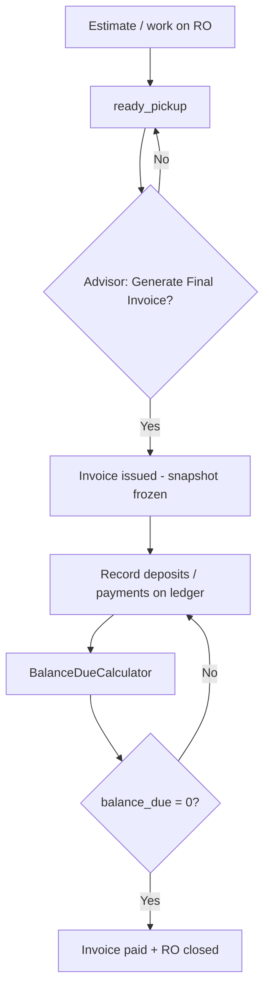

# ARK Financial Authority & Closeout Architecture

**Status:** Partially superseded — 2026-08-03  
**Target architecture:** [`ARK-FINANCIAL-AUTHORITY-V2.md`](ARK-FINANCIAL-AUTHORITY-V2.md) (**Frozen**)

**v2 wins** on: Estimate = living contract · Ledger = money · Invoice = historical Final Invoice only · Invoice is a consequence of closeout · never two living financial contracts · Financial Position projection · suspend living-invoice / refresh work.

This document remains reference for ledger types, post-issuance invoice states, overpay/credit/write-off rules, and BalanceDueCalculator formula shape. Where this file allows a **living invoice** after issuance or **Refresh Invoice** as sync, **v2 is authoritative**.

**North-star question (one answer path):** *What does this customer owe us right now?* → **Financial Position** (v2), not ad-hoc estimate/invoice/deposit math.

**Green light requirements (must exist before invoice/payment UI):**

1. **Explicit invoice issuance** — no auto-invoice on status change  
2. **Invoice operational states** — not balance inference alone  
3. **`BalanceDueCalculator`** — first-class authority; every screen uses it  
4. **Payment ledger** — deposits are ledger rows, not a parallel subsystem  

**Purpose:** Financial truth before implementers write invoices, payments, or closeout UI. This addresses a **true ARK gap** (financial spine), not a visual gap.

---

## What ARK Already Has (Do Not Rebuild)

| Capability | Location | Behavior |
|------------|----------|----------|
| Living estimate totals | `EstimateTotalsCalculator` | Integer cents, line-level rounding, `HALF_UP` |
| Billable disposition rules | `RepairOrderConcernDisposition` + `billableLines()` | Deferred/declined never bill; recommended only until first approval; then **approved-only** living total |
| Estimate PDF snapshots | `EstimateSnapshotBuilder`, `estimate_documents.snapshot_json` | Schema v2 JSON + PDF; living doc per RO today |
| RO lifecycle | `RepairOrderStatus` | Includes `ready_pickup`, `closed` |
| Payment posture (minimal) | `RepairOrderPaymentStatus`, `RepairOrderPaymentRecorder` | Binary unpaid/paid — **to be replaced** by ledger + calculator |
| Financial README | `app/Ark/Operations/Financial/README.md` | Immutable snapshot rule declared; payments/invoices excluded today |

**Risk:** Invoice UI on living `repair_order_lines` without frozen invoice truth destroys auditability and reporting.

---

## Locked Doctrine (Response 1 — Shop-Aligned)

### 1. Invoice = deliberate Final Invoice (internal: invoice snapshot)

**Not** “the estimate itself.” **Not** auto-generated on `ready_pickup`.

```
Living RO (editable estimate workspace)
    ↓ approval + work
Closeout readiness (work + coverage + Financial Position)
    ↓ advisor: Issue Final Invoice (explicit — consequence of closeout)
Final Invoice snapshot (immutable evidence)
    ↓ apply ledger (deposits become applications)
    ↓ payments / write-offs / refunds / credits
Paid (balance due = 0)
    ↓
Closed
```

**Superseded (do not implement):** living invoice until settlement; deposit-tolerant snapshot refresh; advisor Refresh Invoice.

**Why explicit issuance:** Final Invoice is evidence that closeout readiness was met — not a mid-job living document and not a prerequisite invented so payment can begin. See Financial Authority v2 Principle #4.

- **Advisor-facing label:** **Final Invoice** (usability)  
- **Internal/code:** `InvoiceSnapshot`, `InvoiceSnapshotBuilder`, `document_type = invoice`  
- **Estimate** = `repair_orders` + lines; `EstimateTotalsCalculator` while living  
- **Final Invoice** = frozen document; PDF and AR from `snapshot_json` only  

**v1:** One primary final invoice per RO; supplemental work → credit memo / new RO policy (**DECIDE** later).

---

### 2. Invoice lines = approved only

Invoice never includes recommended, deferred, or declined work. Those remain estimate history and future work.

| Disposition | Living estimate | Final invoice |
|-------------|-----------------|---------------|
| Recommended | Conditional | **Never** |
| Approved | Yes | **Yes** |
| Deferred | No | **Never** |
| Declined | No | **Never** |

At issuance: copy approved lines once; freeze totals in snapshot; never re-read living lines for invoice display.

---

### 3. Freeze moment

**Immutable at explicit Issue Final Invoice.** No silent edits to lines, price, tax, or fees on that document. Corrections → revised invoice / supplemental invoice / credit memo — never “refresh.” See v2.

---

### 4. Payment types (ledger metadata)

All money movement is **`repair_order_payments`** (or `payment_ledger`) rows. Types are metadata; they do not change math rules.

**v1 ledger types:**

| `payment_type` | Notes |
|----------------|-------|
| `deposit` | Same ledger; not a separate subsystem |
| `cash` | |
| `check` | Optional `check_number` |
| `card` | No PCI vault in ARK |
| `financing` | Reference only, phase 2 if needed |

**Phase 2 / DECIDE:** `gift_card`, `store_credit_application`, `ach`

---

### 5. Partial payments

**Yes.** Multiple ledger rows per invoice/RO.

---

### 6. Deposits = payment ledger

Deposits are **not** operationally special long-term. They are:

```
payment_type = deposit
```

**Balance formula (only path):**

```
Invoice Snapshot Total
- Deposits (ledger)
- Payments (ledger, non-deposit)
+ Adjustments (ledger / documents)
- Credits applied (ledger)
- Write-offs (reserved, phase 2 UI)
= Balance Due
```

Before final invoice exists: deposits accumulate as **unapplied prepayment** on the RO; once invoice is **issued**, they apply against balance due.

---

### 7. Overpayments → store credit

**Do not** create negative invoice balances.

```
Invoice total    $1,000
Payments         $1,200
→ Balance due    $0
→ Store credit   $200 (customer account)
```

Reject payment entry that would overpay **only if** store credit is disabled — default **allow** and credit the customer (Response 1). *(Alternative: reject overpay in v1 — **DECIDE**; default store credit.)*

---

### 8. Refunds / voids / adjustments

| Concept | Use |
|---------|-----|
| Void payment | Mistaken same-day entry |
| Refund | Money returned |
| Adjustment document | Never edit frozen invoice |
| Credit memo | Post-issue AR reduction |

**Write-offs:** Remaining invoice balance may be waived via ledger `WriteOff` without zeroing line prices. Advisors use **Waive balance** with collection disposition:

| Disposition | Posted sales / Growth revenue |
| --- | --- |
| `retail` (default) | Counts normally |
| `courtesy` · `trade` · `goodwill` | **Excluded** from posted sales and Growth closed-revenue attribution. Invoice total remains **Would have cost**. |
| `bad_debt` | Still counts as posted sales (real sale, uncollected) |

Authority: `repair_orders.collection_disposition` + `collection_disposition_reason` · `WaiveRepairOrderBalanceAction` · `RecordLedgerEntryAction::recordWriteOff`. Closed RO surfaces **Would have cost / Collected / Waived**.

---

### 9. Closeout gate (tightened)

**Paid without an invoice is invalid.**

```
… → in_progress
    → closeout readiness    (work complete; estimate still the only living contract)
    → [Issue Final Invoice] (consequence of closeout; invoice state → issued; immutable)
    → apply ledger + collect remainder
    → balance_due = 0       (invoice state → paid)
    → closed / release      (server enforced)
```

| Gate | Rule |
|------|------|
| Closeout readiness | Work + coverage + Financial Position resolved; estimate still living until Final Invoice |
| **Issue Final Invoice** | Consequence of readiness — not a prerequisite invented to unlock payment |
| Pre-invoice deposits | Ledger only; apply when Final Invoice issues |
| Payments after Final Invoice | Ledger rows; partial OK |
| `closed` | **Only if** balance authority → `balance_due_cents === 0` (or approved write-off) |
| Vehicle release | Default: collect before release (operational handoff) |

**v2:** Do not require an early invoice merely so the shop can take a deposit or show “balance.” Deposits attach to the Ledger against the living Estimate via Financial Position.

Replace `RepairOrderPaymentRecorder::markPaid()` binary flip with ledger + calculator.

**Pre-invoice deposits:** Allowed; tracked on ledger; applied when invoice issues.

---

### 10. Balance authority (non-negotiable)

Two calculators, one ledger, zero UI math:

| Authority | Responsibility |
|-----------|----------------|
| `EstimateTotalsCalculator` | Living estimate only |
| `InvoiceSnapshotBuilder` | Freeze at **Generate Final Invoice** |
| `BalanceDueCalculator` | **All** balance due, invoice state derivation, closeout gates, customer owe |
| Payment ledger | Source rows for deposits, payments, refunds, credits, write-offs |

```php
// BalanceDueCalculator — sole balance path
balance_due_cents =
    invoice_total_cents
  - deposits_applied_cents
  - payments_applied_cents
  + adjustments_cents
  - credits_applied_cents
  - write_offs_cents;  // 0 until phase 2
```

**Forbidden:** Blade, Alpine, controller, presenter, or queue badge math on money.

Controllers return authoritative cents; views format only.

---

## Invoice Operational States

First-class states — **do not infer everything from balance alone.**

| State | Meaning |
|-------|---------|
| `draft` | Optional pre-issue workspace; v1 may skip and create at issuance only |
| `issued` | Snapshot written; AR active; payments allowed |
| `partially_paid` | `0 < balance_due < invoice_total` |
| `paid` | `balance_due === 0` |
| `voided` | Invoice voided; audit row retained; not AR truth |

Sync rule: `BalanceDueCalculator` is authoritative for cents; invoice `status` is updated from calculator result (or materialized on ledger write). Queues and badges read **invoice state**, not recomputed UI logic.

---

## Payment Ledger Authority

All customer money events append immutable ledger rows (void = reversing event, not silent delete).

| Field (conceptual) | Purpose |
|--------------------|---------|
| `repair_order_id` | Scope |
| `invoice_id` | Nullable until invoice issued; then required for payment/application |
| `amount_cents` | Positive for intake; negative for refund |
| `payment_type` | deposit, cash, check, card, … |
| `paid_at` | |
| `voided_at` | |
| `legacy_*` | Import lineage |

**PaymentLedger** domain owns persistence; **BalanceDueCalculator** owns aggregation. No second deposit subsystem.

---

## Customer Statement of Account

Every customer surface must eventually answer: **What does this customer owe us?**

Per customer (and per RO):

```
Invoice #1034 (RO R1522)     $1,500.00
Payment 3/12                 - $  500.00
Balance due                  $1,000.00
Unapplied deposits           $  200.00   (if any)
Store credit available       $   50.00   (if any)
```

**Authority:** `BalanceDueCalculator` + ledger history; customer index/show read-only.

**v1 minimum:** RO payment panel + customer show “open balance” summary.  
**Later:** Full statement PDF, portal, aging.

---

## Financial Workflow Map



---

## Snapshot Rules

1. **Estimate snapshot** — living; may refresh for approval PDF.  
2. **Final invoice snapshot** — immutable at issuance; payment UI + invoice PDF + closed reporting.  
3. **Close PDF** — uses **invoice snapshot totals**, not living lines.  
4. Legacy `legacy_arksms_invoice_id` documents remain reporting truth (no rebuild from living lines).

---

## Database Impact (Planned)

| Table | Purpose |
|-------|---------|
| `estimate_documents` or `financial_documents` | `document_type`: estimate \| invoice \| credit_memo |
| `repair_order_payments` | Payment ledger |
| `customer_credits` or derived from ledger | Store credit balance |
| `repair_orders` | Drop binary-only `payment_status`; cache invoice_state / balance from calculator if needed |

---

## Temporary: `RepairOrderPaymentPostureSync`

**Status:** compatibility bridge only — not doctrine.

Ledger entries + `BalanceDueCalculator` are authoritative. `RepairOrderPaymentPostureSync` copies balance posture into `repair_orders.payment_status` and `paid_at` so existing queue/report code keeps working until the Financial Workflow UI pass surfaces calculator output everywhere.

**Rules:**

- Do not treat `payment_status` as money truth.
- Do not add new features on top of this bridge.
- Remove the class after RO review shows invoice state, balance due, and payments from the calculator.

---

## UI Surfaces (After Financial Core)

| Surface | Authority |
|---------|-----------|
| Generate Final Invoice | `InvoiceSnapshotBuilder` |
| Payment entry | Ledger write → `BalanceDueCalculator` |
| Ready pickup queue | RO status + invoice state + balance badge |
| Close RO | `balance_due_cents === 0` server-side |
| Customer show | Statement of account (calculator) |

**Stop visual work** until Financial Core Pass tests pass.

---

## Implementation Order — Financial Core Pass First

**Not** invoice screens, PDFs, or receipts first.

1. Shop confirms **DECIDE** checklist (below).  
2. **`InvoiceSnapshotBuilder`** + tests (approved lines only).  
3. **`repair_order_payments`** migration + ledger model.  
4. **`BalanceDueCalculator`** + Pest (partial, deposit, overpay→credit, void, pre-invoice deposit).  
5. Actions: `GenerateFinalInvoice`, `RecordPayment`, `VoidPayment`, `RefundPayment`, `CloseRepairOrder`.  
6. Lifecycle gates: issued invoice before closeout payments; closed requires balance 0.  
7. Minimal operations UI (generate invoice + record payment on ready pickup).  
8. Customer open-balance summary.  
9. Portal / receipts / GL — later.

---

## Implementation notes (historical)

**Stop.** Do not use this prompt to build living-invoice sync. Read [`ARK-FINANCIAL-AUTHORITY-V2.md`](ARK-FINANCIAL-AUTHORITY-V2.md) first.

Legacy prompt (ledger / BalanceDueCalculator reference only — supersede closeout sequence with v2):

```
ARK Financial — read docs/ARK-FINANCIAL-AUTHORITY-V2.md (frozen) and docs/ARK-FINANCIAL-AUTHORITY-AND-CLOSEOUT.md (ledger reference).

Do not invent rules. Do not extend living-invoice refresh.

Locked (v2):
- Estimate = living contract; Ledger = money; Invoice = historical Final Invoice only.
- Issue Final Invoice = consequence of closeout readiness — not a mid-job living document.
- Never two living financial contracts on one RO.
- Financial Position = Customer Owes Today.
- Deposits: ledger until Final Invoice applies them.
- Suspend invoice sync / refresh / early-invoice features until v2 adoption.
```

---

## DECIDE Checklist (Remaining)

- [ ] Supplemental invoice per RO or credit-memo-only?  
- [ ] Gift card in v1?  
- [ ] Overpay: store credit (default) vs reject transaction?  
- [x] Write-off UI — **shipped:** Waive balance (courtesy / trade / goodwill / bad debt); retail invoice preserved  
- [ ] Partial payments before final invoice (deposits only)? — default **deposits yes, payments apply at issued**

---

## Assessment

Architecture target: **Estimate → Approval → Final Invoice → Payment → Closeout** = complete operational + financial spine. Everything after is refinement, scale, and polish.

*Aligns with `EstimateTotalsCalculator`, disposition doctrine, and existing `RepairOrderStatus` / close gate — superseding binary `markPaid()`.*
