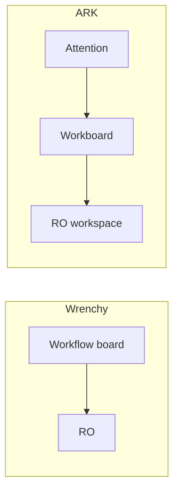

# Interaction Craft vs Product Doctrine v1

**Status:** Frozen v1  
**Standing rule:** Every competitor review — Shopmonkey, Tekmetric, AutoLeap, Mitchell, Fullbay, Shop-Ware, and all that follow — must use this template.  
**Companions:** Projection Rule · Pressure First · Attention Queue · product doctrine · Workspace Rules · [Constitution](ark-constitution-v1.md)

---

## Purpose

Competitor reviews exist to improve ARK's interaction craft without changing its product doctrine.

The goal is not to rank products or collect features.  
The goal is to discover durable interaction patterns while preserving ARK's own mental model.

---

## Permanent rules

**Competitor products are evidence of interaction craft, not evidence of product doctrine.**

**Borrow interaction. Never inherit mental models.**

Interaction craft is transferable (scan speed, density, hierarchy, persistent context).  
Product doctrine is not (workflow ownership, authority boundaries, mental models).

### What Borrow means

**Borrow means:**

- Learn the interaction
- Reproduce the outcome
- Reimplement within ARK doctrine

**Borrow never means:**

- Copy layouts
- Copy workflows
- Copy terminology
- Copy product structure

---

## Standing review format

Every competitor review follows this structure — extract durable insights, not feature checklists:

1. **Operating model**
2. **Interaction craft worth stealing**
3. **Architecture worth rejecting**
4. **Doctrine impact**
5. **Steal list**
6. **Do not steal**
7. **One-sentence takeaway**

Culture: learn without letting competitors dictate ARK's architecture. Name what they solved well. Name why we will not copy everything. Not defensive. Not “we're better.”

The value is not that every review produces new doctrine.  
The value is that every review is evaluated through the same lens — continuous learning without architectural drift.

---

## Worked example: Wrenchy

Source: [wrenchy.io](https://www.wrenchy.io/) · [Workflow](https://www.wrenchy.io/features/workflow) · RO Overview + Workflow Kanban screenshots.

### 1. Operating model

Wrenchy optimizes for: **Where is the car?**  
ARK optimizes for: **What deserves my attention?**

| Morning question | Product answer |
| --- | --- |
| Where are my cars? | Wrenchy Workflow |
| What's on fire? | ARK Attention |

A shop does not wake up asking where the cars are. They ask what is on fire. **Attention answers that.** Workboard orients the queue. RO is where work is performed.

---

### Workboard Doctrine

**The board is not where work lives.**  
**The board is where decisions happen.**

Representing the shop is not the goal.  
Directing the advisor is.

Wrenchy's board tries to represent the shop.  
ARK's Workboard tries to direct the advisor.

Those are different goals.

#### Junk drawer rule

**A board that accepts everything eventually helps with nothing.**

Pressure-first is why the Workboard exists — not visualization. Decision making.

**Every new card field must eliminate a click or a decision. Otherwise it does not belong.**

#### Workboard Card (acceptance criteria)

A single glance should answer:

1. Who?
2. Vehicle?
3. Why?
4. Next?
5. Money?
6. Age?

Everything else belongs inside the RO.  
This is the acceptance criteria for every Workboard card redesign.

---

### Persistent Context

**Definition:** Information required continuously while performing work should remain visible without scrolling or navigation.

These are **postures**, not entities:

| Posture | Examples |
| --- | --- |
| Financial | Totals, due, payment state |
| Approval | Disposition / authorization |
| Communication | Waiting reply, last touch |
| Workflow | Lifecycle / next action |

Shorthand for future decisions: *Should this live in the right rail?* → *Is it Persistent Context?*

Wrenchy pins money in a sticky right rail. That is one choice of persistent context. ARK's right rail should own **posture** — whatever must stay visible while the advisor works — not finance alone.

---

### 2. Interaction craft worth stealing

- Card glance rhythm (who / vehicle / why / next / money / age) — density and hierarchy, not appearance
- Column header counts (count yes; infinite pile no)
- RO chrome: concern + # + disposition/payment badges; customer phone never name-only
- Persistent context rail (posture, not KPI theater)
- **Card hover** — richer projection on hover (customer, vehicle, concern, advisor, total, approval) without opening the RO; not another authority
- Card-edge pay/schedule — only after notebook proves advisors leave the board for those two jobs
- Compact event strip later from Journey/events — never Overview KPI wall

### 3. Architecture worth rejecting

- Workflow-as-home (“where is the car?”)
- Infinite Estimates column / junk-drawer board
- Paid invoices living in Estimates (document type ≠ lifecycle)
- Overview profit/margin theater (Infinity%/NaN% is the tell)
- Estimate ↔ Invoice toggle as workflow authority
- **Peer RO tabs that are not peers** — Carfax / Timeclocks / Appointments are projections:

| Concern | Belongs to |
| --- | --- |
| Appointments | Scheduling |
| Time | Production |
| Carfax / history | Vehicle History |

The RO must not become a junk drawer either.

- Empty note quadrants as permanent chrome
- Channel-first Message buttons competing with Conversation
- Settings-first Kanban customization before observation
- AI review-reply product (Earned Intelligence)

### 4. Doctrine impact

| Discovery | Doctrine home |
| --- | --- |
| Attention vs location | Attention Queue · this document |
| Board = decisions | **Workboard Doctrine** (above) |
| Card glance criteria | Workboard Card acceptance |
| Persistent context | Right rail / workspace hierarchy |
| Peer tabs = projections | Projection Rule · Surfaces |
| Screenshots ≠ doctrine | Permanent rules (top) |

### 5. Steal list

Earned later from floor pain — not from the screenshot alone:

1. Enforce Workboard Card glance checklist on redesigns
2. Column header counts where missing
3. Card hover richer projection
4. Card-edge pay/schedule after repeated bounce-off-board sentences
5. RO header scan line + right-rail postures
6. Compact event strip from Journey/events

### 6. Do not steal

- Workflow-as-home mental model
- Infinite Estimates junk drawer
- Profit/margin widgets on RO Overview
- Peer tab strip (Carfax / Timeclock / Appointments)
- Configurable Kanban Settings before observation
- AI review reply product

### 7. One-sentence takeaway

**Borrow scan speed. Reject information architecture.**

---

## Borrow / Reject

**Borrow**

- Scan speed
- Visual rhythm
- Density
- Hierarchy
- Persistent context

**Reject**

- Mental model
- Workflow ownership
- Authority model
- Tab hierarchy
- KPI theater
- Settings-first customization

That discipline keeps ARK from becoming “Wrenchy with different colors” — and keeps every future competitor review extracting craft without inheriting doctrine.

---

## Review Checklist

Before a competitor review is complete:

- [ ] Did we identify the competitor's operating model?
- [ ] Did we separate interaction craft from product doctrine?
- [ ] Did we explicitly reject incompatible mental models?
- [ ] Did every “steal” item improve interaction without creating a new authority?
- [ ] Can the final takeaway be expressed as “Borrow X. Reject Y.”?

---

## Freeze

**Interaction Craft vs Product Doctrine v1** — frozen.

Revision only when clusters of review outcomes prove the template itself failed — not because a new competitor has a prettier screen.

**Process stability:** Do not edit this document during a competitor review. If a Shopmonkey, Tekmetric, AutoLeap, Mitchell, or other review seems to “need” a template change, capture that pressure in a separate notebook note. Only after multiple reviews expose the same limitation consider a v2.
